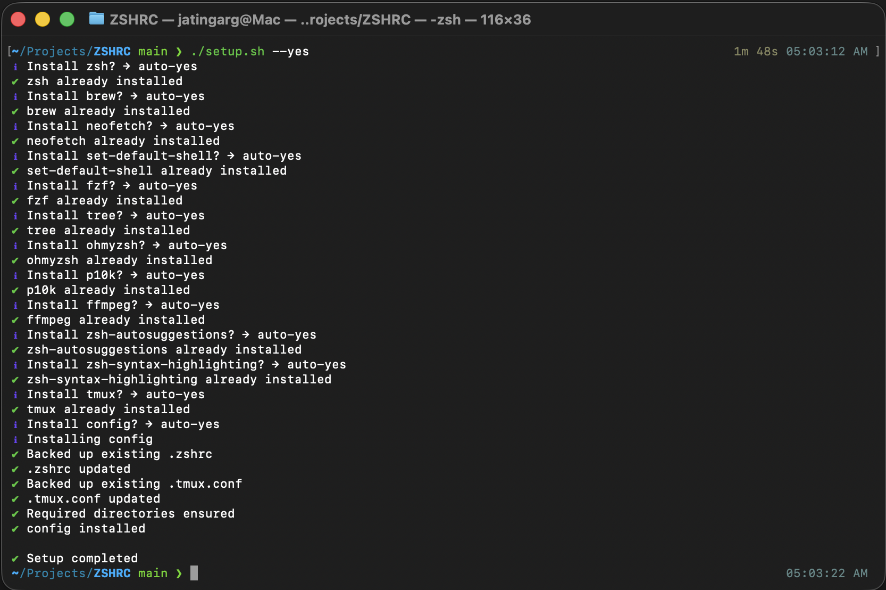
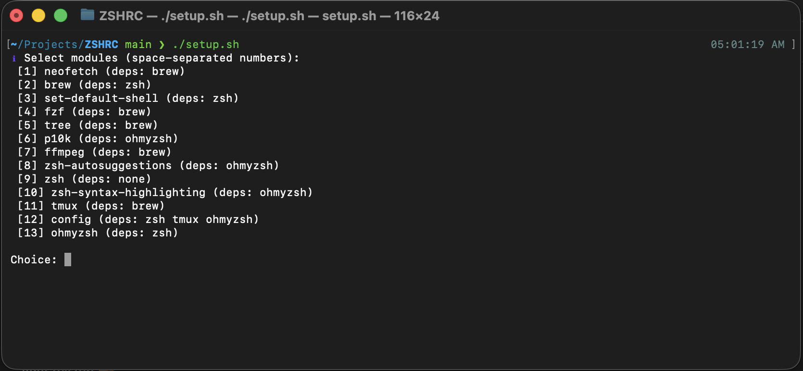
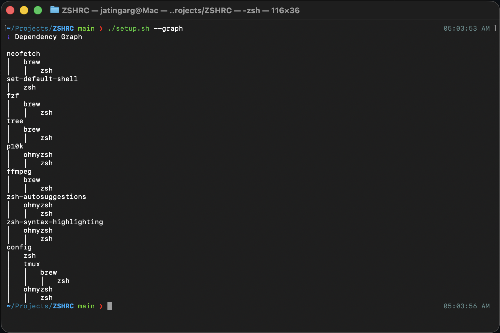
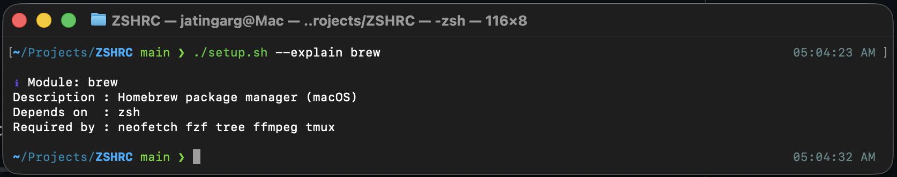

# 🛠️ Interactive Zsh Setup & Tooling Installer

A **dependency-aware, interactive, and explainable setup system** for Zsh-based developer environments.

This project lets you:
- Install tools **safely** with dependency resolution
- Select **only the modules you need**
- Preview changes with **dry-run**
- Understand **why** something is installed
- Visualize the **dependency graph**

Built for **power users**, **senior engineers**, and **dotfile minimalists**.

---

## ✨ Features

- ✅ Dependency graph with automatic skipping
- ✅ Interactive module selection
- ✅ Install specific modules only
- ✅ `--dry-run` for safe previews
- ✅ `--yes` for CI / automation
- ✅ `--graph` to visualize dependencies
- ✅ `--explain <module>` for clarity
- ✅ Idempotent & re-runnable
- ✅ Modular & extensible architecture
- ✅ Explicit `--set-shell` flag to safely set Zsh as the default shell
- ✅ Automatic CI detection to skip shell changes in CI/CD environments


---

## 📁 Project Structure

```text
setup/
├── setup.sh
├── lib/                # Core engine & utilities
├── modules/            # Installable modules
├── zshrc
├── tmux.conf
└── README.md
````

---

## 🚀 Quick Start

```bash
git clone <your-repo-url>
cd setup
chmod +x setup.sh
./setup.sh
```

This launches an **interactive menu**.

---

## 🔧 Usage

### Install Everything (interactive)

```bash
./setup.sh
```

### Install Specific Modules

```bash
./setup.sh tmux fzf config
```

### List Available Modules

```bash
./setup.sh --list
```

### Dry Run (no changes made)

```bash
./setup.sh --dry-run tmux
```

### Non-interactive / CI Mode

```bash
./setup.sh --yes zsh ohmyzsh p10k
```

By default, this setup **does not change your login shell** for safety reasons. 
If you explicitly want to make **Zsh your default shell**, use the `--set-shell` flag.

### Set Zsh as default shell

```bash
./setup.sh --set-shell
```
This will:

Verify zsh is installed

Ensure it exists in /etc/shells

Change your default login shell using chsh

> ⚠️ You may be prompted for your system password.

---

## 🧠 Dependency Graph

```bash
./setup.sh --graph
```

Example output:

```text
zsh
├── ohmyzsh
│   ├── p10k
│   └── zsh-autosuggestions
├── brew
│   ├── tmux
│   └── fzf
```

---

## 📖 Explain a Module

```bash
./setup.sh --explain tmux
```

Output:

```text
Module: tmux
Description : Terminal multiplexer
Depends on  : brew
Required by : none
```

---

## 🧩 Modules Included

* `zsh`
* `brew` (macOS)
* `tmux`
* `ohmyzsh`
* `p10k`
* `zsh-autosuggestions`
* `zsh-syntax-highlighting`
* `fzf`
* `tree`
* `neofetch`
* `ffmpeg`
* `config` (zshrc, tmux.conf, directories)

---

## 🖼️ Screenshots

### Fully Automatic Menu


### Interactive Menu


### Dependency Graph


### Explain Command


---

## ⚠️ Notes

* Powerlevel10k requires a **Nerd Font**
  👉 [https://www.nerdfonts.com](https://www.nerdfonts.com)
* Linux users may need `sudo` privileges
* Safe to re-run anytime

---

## 🤝 Contributing

Contributions are welcome!
See [`CONTRIBUTING.md`](CONTRIBUTING.md).

---

## 📜 License

This configuration is provided as-is. Feel free to customize it for your needs.

--- 

Simple. Fast. Safe. Enjoy your Zsh ⚡